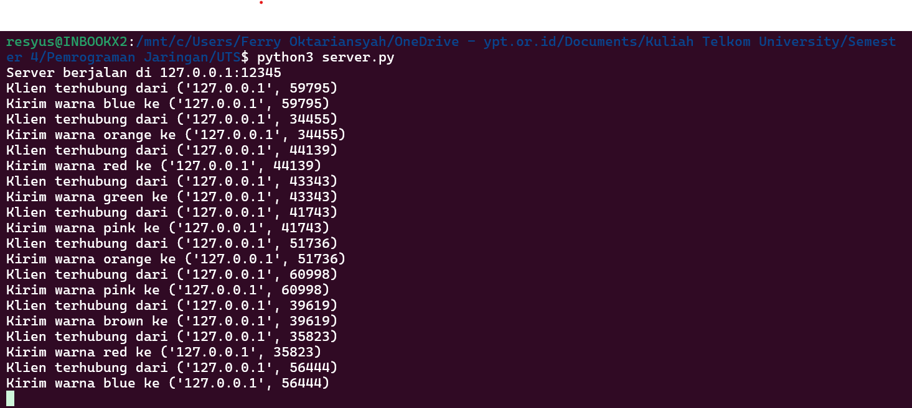
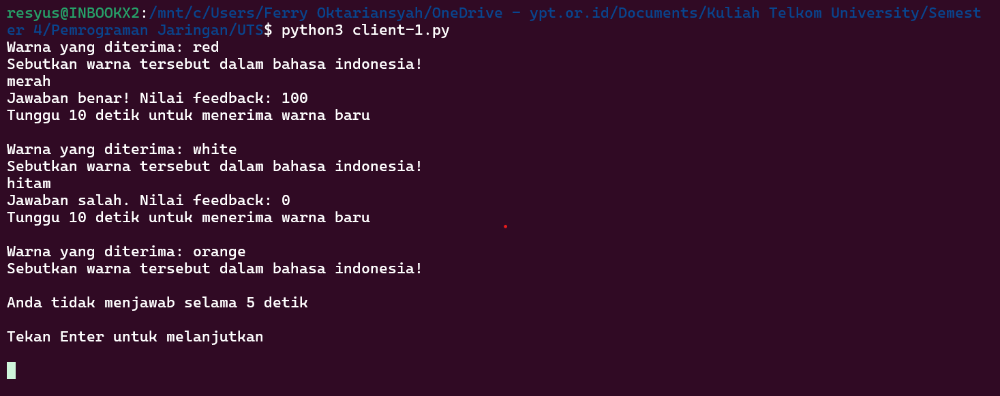
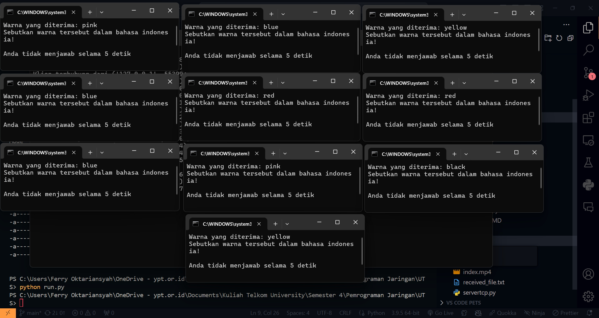

```
Nama: Ferry Oktariansyah
NIM: 1203220006
Kelas: IF-02-01
```

---

### \* [Alur Berjalannya Kode Program](#alur-kode)

### \* [Penggunaan Proggram](#Penggunaan)

---

## Soal

Buatlah sebuah permainan yang menggunakan soket dan protokol UDP. Permainannya cukup sederhana, dengan 1 server dapat melayani banyak klien (one-to-many). Setiap 10 detik, server akan mengirimkan kata warna acak dalam bahasa Inggris kepada semua klien yang terhubung. Setiap klien harus menerima kata yang berbeda (unik). Selanjutnya, klien memiliki waktu 5 detik untuk merespons dengan kata warna dalam bahasa Indonesia. Setelah itu, server akan memberikan nilai feedback 0 jika jawabannya salah dan 100 jika benar.

## <br>

## Alur Kode

Kode ini beroperasi menggunakan soket UDP dalam bahasa Python, menerapkan konfigurasi one-to-many yang memungkinkan satu server untuk menangani banyak klien secara bersamaan.

Berikut adalah rincian dari kode server dan klien:

`server.py`

```python
import socket
import random
import time


def generate_random_color():
    colors = ["red", "green", "blue", "yellow", "purple",
              "orange", "black", "white", "brown", "pink"]
    return random.choice(colors)


server_ip = "127.0.0.1"
server_port = 12345

server_socket = socket.socket(socket.AF_INET, socket.SOCK_DGRAM)
server_socket.bind((server_ip, server_port))

print(f"Server berjalan di {server_ip}:{server_port}")

connected_clients = set()

while True:
    try:
        data, client_address = server_socket.recvfrom(1024)
        data = data.decode("utf-8")

        if client_address not in connected_clients:
            connected_clients.add(client_address)
            print(f"Klien terhubung dari {client_address}")

        if data == "request_color":
            color = generate_random_color()
            server_socket.sendto(color.encode("utf-8"), client_address)
            print(f"Kirim warna {color} ke {client_address}")

    except KeyboardInterrupt:
        print("\nServer berhenti.")
        break

server_socket.close()
```

**Output:**



**Penjelasan:**

Kode di atas melibatkan pembuatan server UDP yang dapat mengirim nama-nama warna acak kepada beberapa klien atas permintaan mereka. Server menggunakan modul standar seperti `socket` untuk komunikasi jaringan, dan `random` untuk menghasilkan warna acak.

- Dimulai dengan mendefinisikan fungsi `generate_random_color()` yang secara acak memilih warna dari daftar yang telah ditentukan.
- IP server dan port diatur, dengan server mengikat ke pengaturan ini.
- Server terus menerus mendengarkan pesan masuk. Setelah menerima pesan "request_color" dari klien, server mengirim kembali warna yang dipilih secara acak.
- Mengelola koneksi klien baru dengan menyimpan alamat mereka dan mengenali saat klien mengirim permintaan warna.
- Saat terjadi gangguan, server dengan aman menutup koneksi.

Server ini dapat melayani beberapa klien secara bersamaan dengan mengelola alamat mereka dan melayani warna unik atas permintaan.

<br>

`client.py`

```python
import socket
import time
import threading


def english_to_indonesian_color(english_color):
    color_mapping = {
        "red": "merah",
        "green": "hijau",
        "blue": "biru",
        "yellow": "kuning",
        "purple": "ungu",
        "orange": "oranye",
        "black": "hitam",
        "white": "putih",
        "brown": "coklat",
        "pink": "merah muda",
    }
    return color_mapping.get(english_color.lower(), "tidak dikenali")


server_ip = "127.0.0.1"
server_port = 12345

client_socket = socket.socket(socket.AF_INET, socket.SOCK_DGRAM)


while True:
    try:
        def input_with_timeout(prompt, timeout):
            print(prompt, flush=True)
            response = [None]

            def input_thread():
                try:
                    response[0] = input()
                except:
                    pass

            thread = threading.Thread(target=input_thread)
            thread.start()
            thread.join(timeout)

            if thread.is_alive():
                print(f"\nAnda tidak menjawab selama {timeout} detik\n")
                print("Tekan Enter untuk melanjutkan\n")
                thread.join()

                return None
            else:
                return response[0]

        client_socket.sendto("request_color".encode(
            "utf-8"), (server_ip, server_port))
        color, server_address = client_socket.recvfrom(1024)
        color = color.decode("utf-8")
        print(f"Warna yang diterima: {color}")

        response = input_with_timeout(
            "Sebutkan warna tersebut dalam bahasa indonesia! ", 5)

        indonesian_color = english_to_indonesian_color(color)
        if response is None:
            print("Waktu habis. Nilai feedback: 0")
        elif response.lower() == indonesian_color:
            print("Jawaban benar! Nilai feedback: 100")
        else:
            print("Jawaban salah. Nilai feedback: 0")

        print("Tunggu 10 detik untuk menerima warna baru\n")
        time.sleep(10)
    except KeyboardInterrupt:
        print("\nKlien berhenti.")
        break

client_socket.close()

```

**Output:**



**Penjelasan:**

Kode klien terhubung ke server dan meminta warna, yang kemudian diterjemahkan dari Bahasa Inggris ke Bahasa Indonesia dalam periode waktu yang ditentukan. Fitur utama termasuk:

- Menggunakan soket untuk komunikasi jaringan dan threading untuk menangani input pengguna dalam waktu tertentu.
- Meminta pengguna untuk menerjemahkan warna yang diterima dan memverifikasi respons mereka terhadap terjemahan yang benar yang disimpan dalam kamus.
- Memberikan umpan balik berdasarkan keakuratan respons pengguna, dengan sistem untuk menangani respons yang tidak tepat atau jawaban yang salah secara efektif.
- Mengelola interaksi pengguna dan memelihara loop untuk terus meminta dan menerjemahkan warna.

Setup klien ini memastikan partisipasi interaktif dan

respons yang tepat waktu terhadap komunikasi server.

## <br>

## Penggunaan

### Menjalankan Satu Server dan Klien

Untuk menggunakan setup ini, jalankan kedua file `server.py` dan satu instance `client.py`:

```
> python server.py
```

<br>


```
> python client.py
```

<br>


> Catatan:
>
> - Tebakan yang benar mendapatkan skor umpan balik 100.
> - Tebakan yang salah mendapatkan skor umpan balik 0.
> - Jika tidak ada input yang diberikan dalam waktu yang ditentukan, pesan timeout akan muncul, meminta Anda untuk menekan Enter untuk melanjutkan.
>
> Server mengirim warna baru kepada klien setiap 10 detik, terlepas dari kebenaran atau waktu respons.

### Menjalankan Satu Server dengan Banyak Klien

Untuk banyak klien, jalankan skrip `run.py`:

```
> python run.py
```



> Catatan:
>
> - Jawaban yang benar diberi skor umpan balik 100.
> - Jawaban yang salah diberi skor umpan balik 0.
> - Jika tidak ada input yang diberikan dalam batas waktu 5 detik, pesan timeout muncul yang meminta Anda untuk melanjutkan.
>
> Server mengirim warna baru kepada setiap klien setiap 10 detik, terlepas dari respons.
